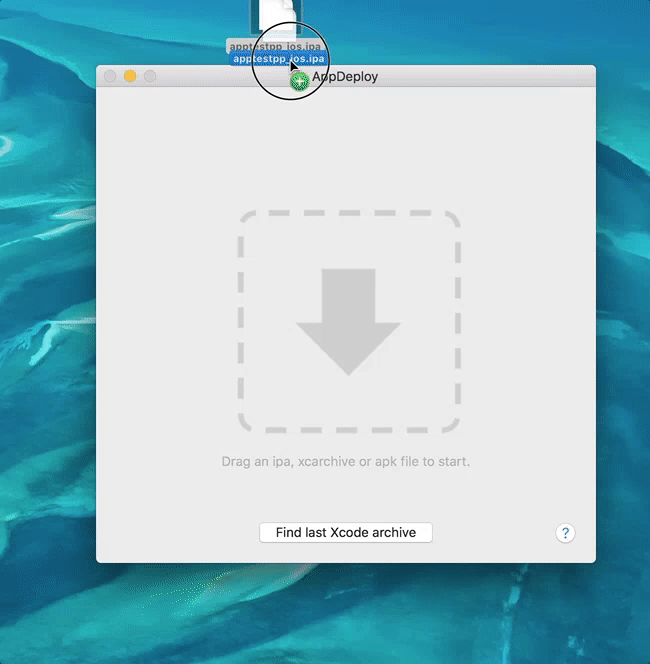
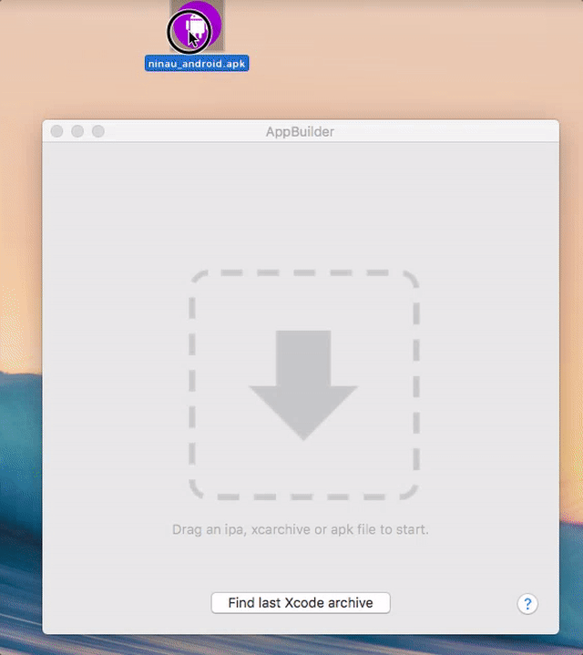
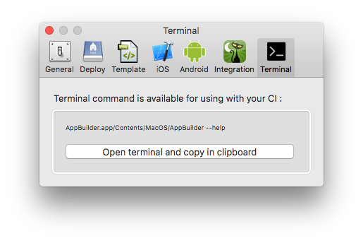

AppBuilder - Visualize, template and deploy your app in a second.
============

AppBuilder is the fastest way to deploy your mobile app to any server without configuration or environment constraints it only uses html.

## Usage
Currently used in our production toolchain with a Jenkins building the app with gym (fastlane) and AppBuilder is generating the download page in script mode from the ipa file.

## Features
- [x] Get quick info on your iOS and android App (support of .xcarchive, .ipa and .apk archive)
- [x] iOS: Get fast access to your app ressource, and plist info
- [x] iOS: Get notified when you did a build and allow to handle it
- [x] Use default template (branded or with app icone) or create your own one with html
- [x] Deploy on your server without extra configuration just html is required
- [x] Usage in you CI by using it in command line
- [x] Notify the build with success with Hipchat or Prowl
- [x] Download the app with a versionned url

## Download and installation
Coming soon

## Requirements
- OSX10.9

## Presentation

#### Supported files

Drag any apk, xcarchive, ipa

#### Choose the template you like

#### Deploy with a click

#### Full integration with Xcode archive
Double check you archive information

#### Rich settings

## Improvments (feadback appreciated)

General

	- find another icone
	- find a new name

Display

	- display more information such size of resources and repartition
	- display validity of certificates
	- .app MacApp support
	- MultiWindow support
	- Add a comment section

Signing (iOS)

	- Ipa : display more information about signing information
	- Xcarchvie : Weakness of the signing part due to certificate issue, and complexity build issue. Not sure it is the role of this tool.
	- Resiging by choosing a certificate
	- Upload Dsym
	- Automatically delegate signing to Fastlane (gym) if present

Network

	- Improvment of the network upload fiability
	- Add cancel button
	- SSH mode has no progress bar
	- Dropbox support for sharing
	- generate random url for privacy

Templating

	- Improvment of the template management
	- Allow a template store to share its template

Uploading

	- Cancel a build/upload in progress

Settings

Notification

	- slack support

Knowns bugs

	- Going to settings cancel the current build upload
	- ⚠️ Store password in keychain or encrypt them in the settings (sftp only, ssh mode is secured)  

## License
TODO

## Feature requests and feedback
Ping me on [twitter](ReadmeData/http://twitter.com/nlauquin) or follow for updates.

If you want to help me, tell me which usage you will use or like to do with this tool:
- 1/ Easy way to consult app
- 2/ Integration in my toolchain (jenkins)
- 3/ Manual usage pour deploying app

- Which part to remove/which to focus on?
